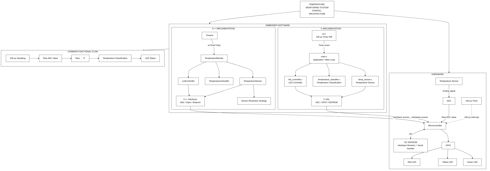
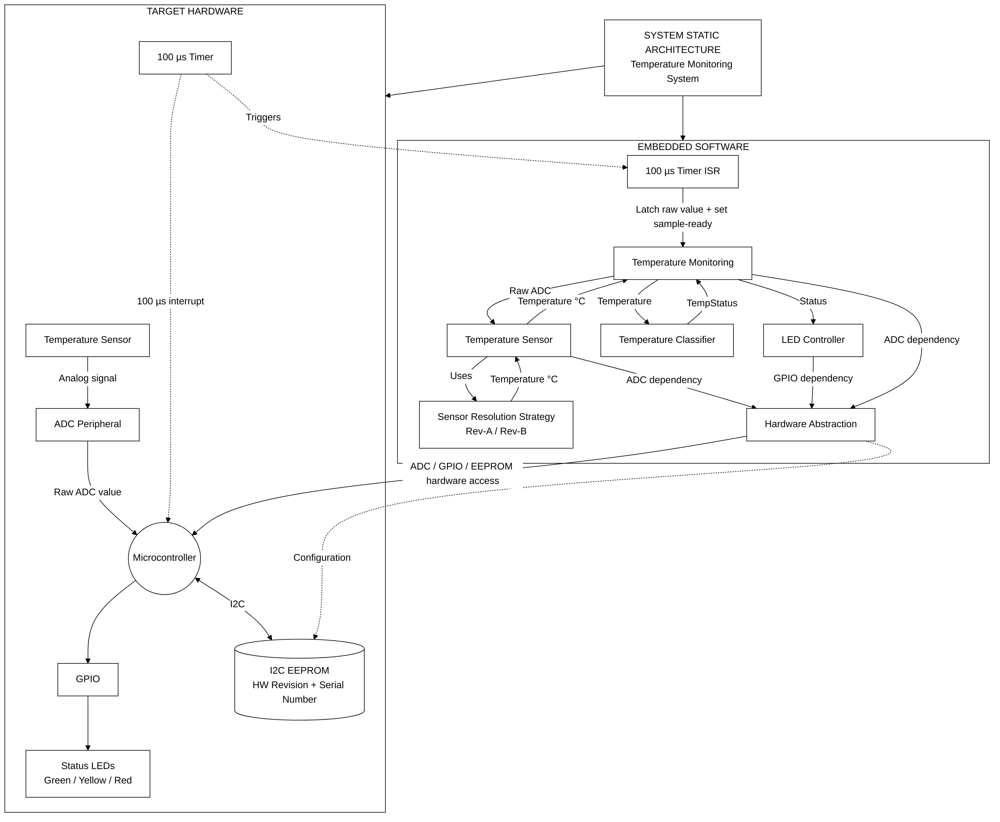
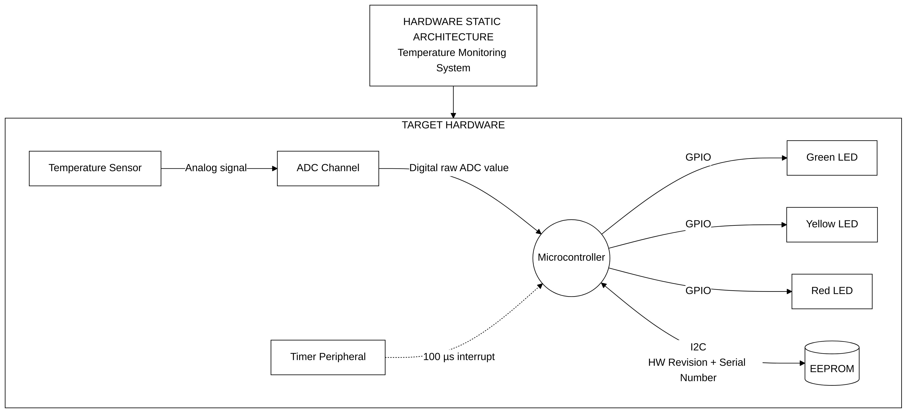
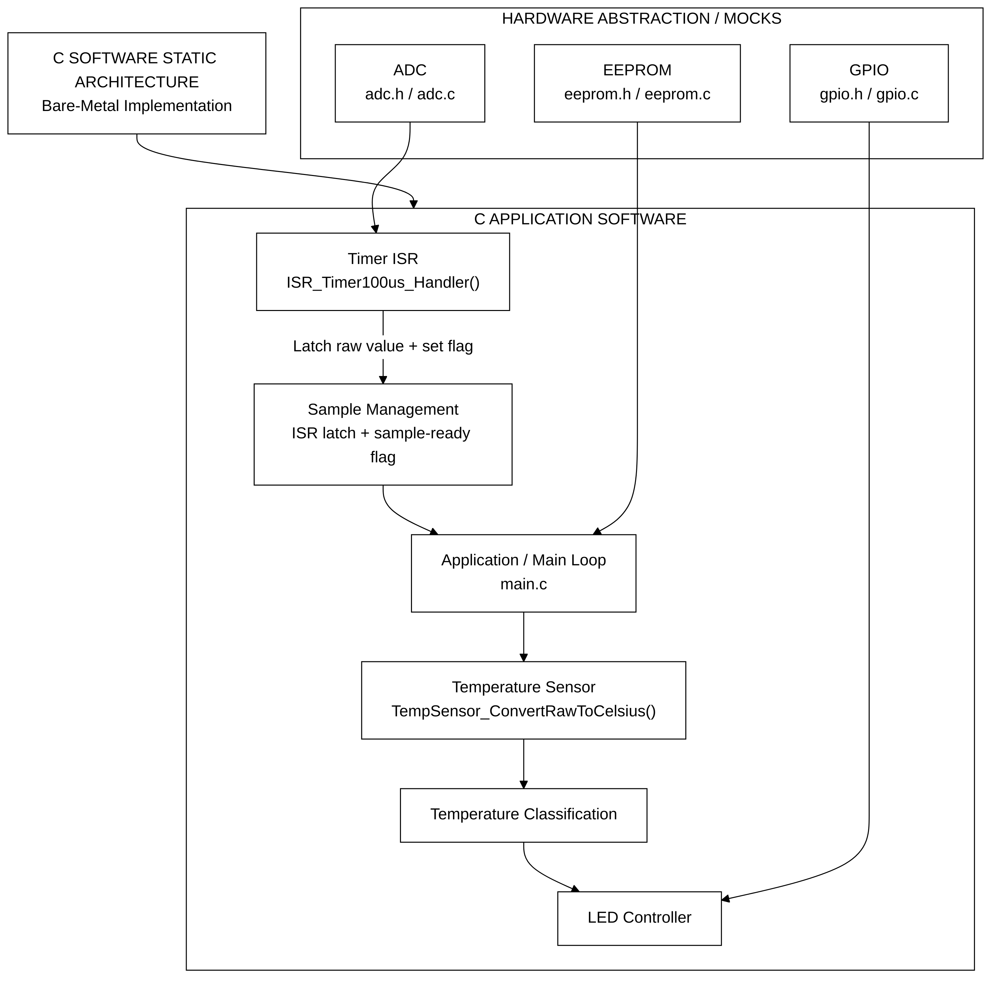
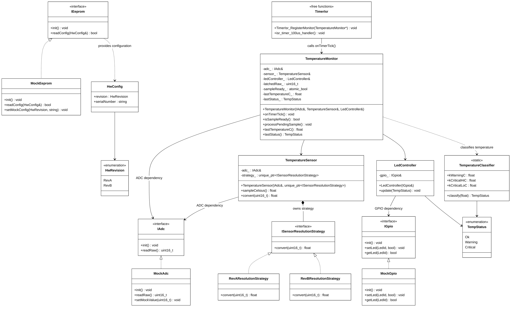
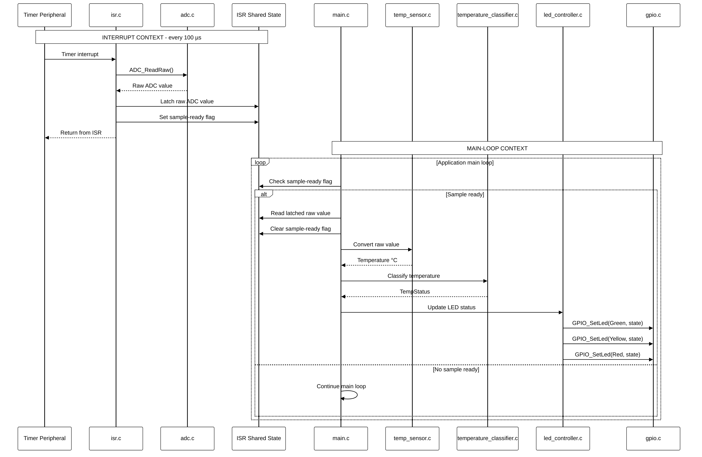
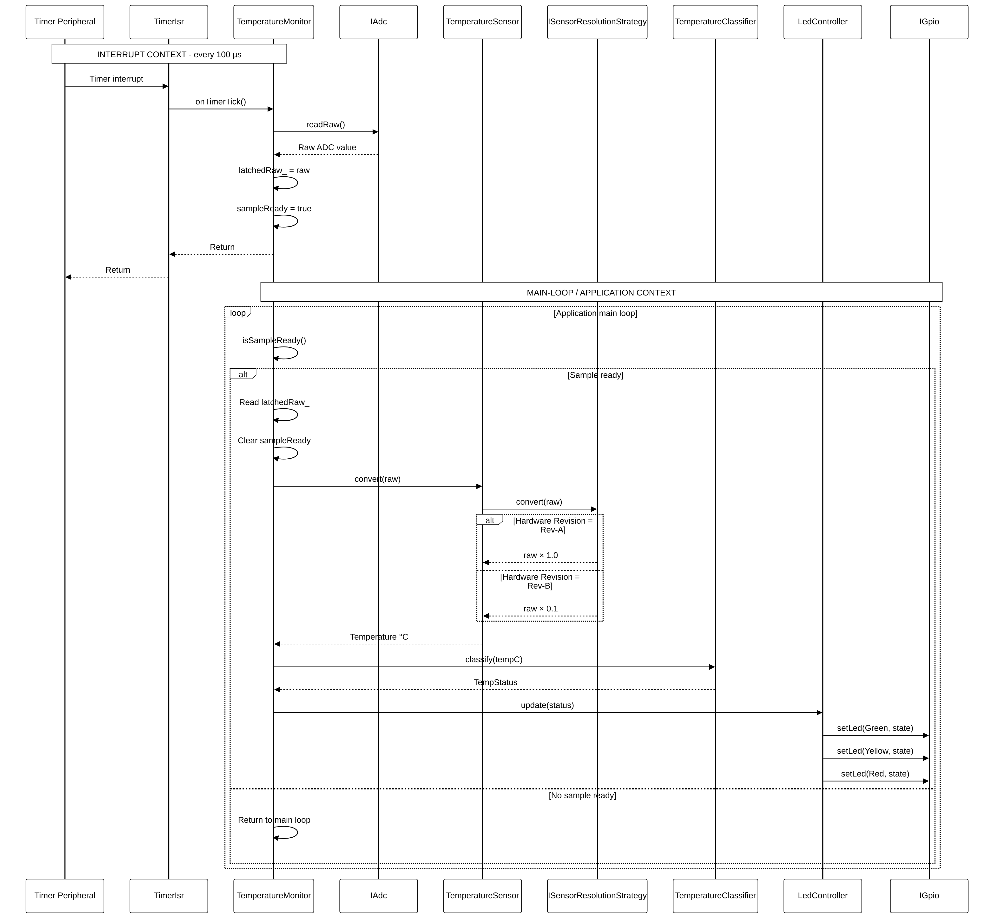

# Temperature Monitoring System — Architecture Diagrams

This document describes the architecture of the Temperature Monitoring System, including the overall system view, hardware architecture, C implementation, C++ implementation, runtime behaviour, PC demonstration architecture, error handling, and traceability.

The C and C++ implementations provide the same functional behaviour but use different software design approaches:

* C: procedural implementation with C hardware-abstraction APIs and shared ISR state.
* C++: object-oriented implementation using interfaces, dependency injection, encapsulation and the Strategy pattern.

All architecture diagrams are provided as pre-rendered black-and-white PNG files under `docs/diagrams/`.

The architecture documentation contains the following views:

* Overall system architecture
* System static architecture
* Hardware static architecture
* C software static architecture
* C++ software static architecture
* C software dynamic architecture
* C++ software dynamic architecture
* PC demonstration architecture
* Temperature processing flow
* EEPROM configuration flow
* Error handling architecture
* Architecture-to-requirement traceability

The static views describe system structure, interfaces and component dependencies.

The dynamic views describe runtime behaviour, including the separation between the 100 µs timer interrupt context and deferred application processing.

The PC demonstration uses mocked hardware interfaces. No target hardware or emulator is required for the PC demonstration.

---

# 1. Overall System Architecture

This is the highest-level architecture showing the relationship between the physical hardware and the two software implementations.



<details>

<summary>Mermaid source</summary>

```text
%%{init: {'theme': 'base', 'themeVariables': {
  'background':'#ffffff',
  'primaryColor':'#ffffff',
  'primaryBorderColor':'#000000',
  'primaryTextColor':'#000000',
  'lineColor':'#000000',
  'secondaryColor':'#ffffff',
  'tertiaryColor':'#ffffff',
  'clusterBkg':'#ffffff',
  'clusterBorder':'#000000',
  'edgeLabelBackground':'#ffffff',
  'fontFamily':'Helvetica'
}}}%%

graph TB

    SYSTEM["TEMPERATURE MONITORING SYSTEM"]

    subgraph HW["TARGET HARDWARE"]
        SENSOR["Temperature Sensor"]
        ADC["ADC Peripheral"]
        TIMER["100 µs Timer Peripheral"]
        MCU["Microcontroller"]
        GPIO["GPIO"]
        LEDS["Green / Yellow / Red LEDs"]
        EEPROM["I2C EEPROM"]
    end

    subgraph SW["SOFTWARE IMPLEMENTATIONS"]
        CAPP["C IMPLEMENTATION"]
        CPPAPP["C++ IMPLEMENTATION"]
    end

    subgraph PC["PC DEMONSTRATION"]
        CMOCK["C Mock HAL"]
        CPPMOCK["C++ Mock Interfaces"]
    end

    SENSOR -->|"Analog signal"| ADC
    ADC -->|"Raw ADC value"| MCU
    TIMER -.->|"100 µs interrupt"| MCU
    MCU --> GPIO
    GPIO --> LEDS
    MCU <-->|"I2C"| EEPROM

    MCU --> CAPP
    MCU --> CPPAPP

    CAPP -. "PC build" .-> CMOCK
    CPPAPP -. "PC build" .-> CPPMOCK

    SYSTEM --> HW
    SYSTEM --> SW
    SYSTEM --> PC
```

</details>

### Architecture principle

The system functionality is implemented independently in C and C++.

Both implementations use the same conceptual processing chain:

```text
Temperature Sensor
       |
       v
      ADC
       |
       v
Raw ADC value
       |
       v
Temperature conversion
       |
       v
Temperature classification
       |
       v
LED status
```

The C and C++ implementations are alternative software implementations of the same functional system.

---

# 2. System Static Architecture



<details>

<summary>Mermaid source</summary>

```text
graph TB

    subgraph SYSTEM["TEMPERATURE MONITORING SYSTEM"]

        subgraph HW["TARGET HARDWARE"]
            SENSOR["Temperature Sensor"]
            ADC["ADC Peripheral"]
            TIMER["100 µs Timer"]
            MCU["Microcontroller"]
            GPIO["GPIO"]
            LEDS["Status LEDs"]
            EEPROM["I2C EEPROM"]
        end

        subgraph CAPP["C SOFTWARE"]
            CMAIN["main.c"]
            CISR["isr.c"]
            CSENSOR["temp_sensor.c"]
            CCLASS["temperature_classifier.c"]
            CLED["led_controller.c"]
            CADC["adc.c"]
            CGPIO["gpio.c"]
            CEEPROM["eeprom.c"]
        end

        subgraph CPPAPP["C++ SOFTWARE"]
            CMON["TemperatureMonitor"]
            CSENS["TemperatureSensor"]
            CCLASS2["TemperatureClassifier"]
            CLED2["LedController"]
            CADCI["IAdc"]
            CGPIOI["IGpio"]
            CEEPI["IEeprom"]
            STRAT["Sensor Resolution Strategy"]
            ISRCPP["TimerIsr"]
        end

        subgraph PC["PC DEMONSTRATION"]
            CM["C Mock HAL"]
            CPM["C++ Mock Interfaces"]
        end
    end

    SENSOR --> ADC
    ADC --> MCU
    TIMER -.-> MCU
    MCU --> GPIO
    GPIO --> LEDS
    MCU <-->|"I2C"| EEPROM

    MCU --> CAPP
    MCU --> CPPAPP

    CAPP -. "PC build" .-> CM
    CPPAPP -. "PC build" .-> CPM
```

</details>

### Execution environments

**Target environment**

* MCU
* ADC
* Timer
* GPIO
* I2C EEPROM
* Embedded C or C++ implementation

**PC demonstration environment**

* C Mock ADC/GPIO/EEPROM
* C++ Mock ADC/GPIO/EEPROM
* Software invocation of the timer ISR
* Functional execution without target hardware

The PC demonstration does not verify actual MCU timing, interrupt latency or electrical peripheral behaviour.

---

# 3. Hardware Static Architecture



<details>

<summary>Mermaid source</summary>

```text
graph LR

    SENSOR["Temperature Sensor"]
    ADC["ADC Channel"]
    MCU["Microcontroller"]
    TIMER["Timer Peripheral"]
    GPIO["GPIO"]
    GREEN["Green LED"]
    YELLOW["Yellow LED"]
    RED["Red LED"]
    EEPROM["I2C EEPROM"]

    SENSOR -->|"Analog signal"| ADC
    ADC -->|"Digital raw value"| MCU
    TIMER -. "100 µs interrupt" .-> MCU

    MCU --> GPIO
    GPIO --> GREEN
    GPIO --> YELLOW
    GPIO --> RED

    MCU <-->|"I2C"| EEPROM
```

</details>

### Hardware interfaces

| Hardware           | Interface              | Purpose                                     |
| ------------------ | ---------------------- | ------------------------------------------- |
| Temperature Sensor | Analog                 | Temperature measurement                     |
| ADC                | Internal MCU interface | Converts analog signal to raw digital value |
| Timer              | Interrupt              | Generates periodic 100 µs sampling event    |
| GPIO               | Digital output         | Controls status LEDs                        |
| EEPROM             | I2C                    | Stores hardware revision and serial number  |
| MCU                | Central controller     | Executes embedded software                  |

### Hardware revisions

| Revision | Sensor resolution |
| -------- | ----------------: |
| Rev-A    |        1 °C/digit |
| Rev-B    |      0.1 °C/digit |

The active sensor conversion is selected from the hardware revision stored in EEPROM.

---

# 4. C Software Static Architecture

The C implementation uses procedural C functions and explicit hardware-abstraction APIs.



<details>

<summary>Mermaid source</summary>

```text
graph TB

    subgraph APP["C APPLICATION"]

        MAIN["main.c"]

        ISR["isr.c
100 µs Timer ISR"]

        SENSOR["temp_sensor.c/.h
Temperature conversion"]

        CLASSIFY["temperature_classifier.c/.h
Temperature classification"]

        LED["led_controller.c/.h
LED control"]

        STATE["ISR shared state
Latched raw value
Sample-ready flag"]
    end

    subgraph HAL["C HARDWARE ABSTRACTION"]

        ADC["adc.c/.h
ADC_Init()
ADC_ReadRaw()"]

        GPIO["gpio.c/.h
GPIO_Init()
GPIO_SetLed()
GPIO_GetLed()"]

        EEPROM["eeprom.c/.h
EEPROM_Init()
EEPROM_ReadConfig()"]
    end

    subgraph MOCK["PC MOCK IMPLEMENTATION"]

        ADCMOCK["ADC mock"]
        GPIOMOCK["GPIO mock"]
        EEPROMMOCK["EEPROM mock"]
    end

    MAIN --> SENSOR
    MAIN --> CLASSIFY
    MAIN --> LED
    MAIN --> EEPROM
    MAIN --> STATE

    ISR --> ADC
    ISR --> STATE

    SENSOR --> ADC
    LED --> GPIO

    ADC -. "PC build" .-> ADCMOCK
    GPIO -. "PC build" .-> GPIOMOCK
    EEPROM -. "PC build" .-> EEPROMMOCK
```

</details>

### C software responsibilities

| Component                     | Responsibility                                                     |
| ----------------------------- | ------------------------------------------------------------------ |
| `main.c`                      | Initialization and deferred application processing                 |
| `isr.c`                       | 100 µs timer interrupt handling                                    |
| `adc.c/.h`                    | ADC hardware abstraction                                           |
| `temp_sensor.c/.h`            | Raw ADC to Celsius conversion                                      |
| `temperature_classifier.c/.h` | OK / Warning / Critical classification                             |
| `led_controller.c/.h`         | Status LED control                                                 |
| `gpio.c/.h`                   | GPIO hardware abstraction                                          |
| `eeprom.c/.h`                 | Hardware revision and serial-number configuration                  |
| ISR shared state              | Transfers sampled raw data from ISR context to application context |

### C ISR design

The ISR is intentionally kept minimal:

```text
100 µs Timer
     |
     v
   isr.c
     |
     +--> ADC_ReadRaw()
     |
     +--> Latch raw ADC value
     |
     +--> Set sample-ready flag
     |
   return
     |
     v
   main.c
     |
     +--> Check sample-ready
     |
     +--> Read latched value
     |
     +--> Convert to Celsius
     |
     +--> Classify
     |
     +--> Update LED
```

Temperature conversion, classification and LED control are not performed inside the timer ISR.

---

# 5. C++ Software Static Architecture

The C++ implementation uses interfaces, dependency injection, encapsulation and the Strategy pattern.



<details>

<summary>Mermaid source</summary>

```text
classDiagram

    class IAdc {
        <<interface>>
        +init() void
        +readRaw() uint16_t
    }

    class IGpio {
        <<interface>>
        +init() void
        +setLed(LedId, bool) void
        +getLed(LedId) bool
    }

    class IEeprom {
        <<interface>>
        +init() void
        +readConfig(HwConfig&) bool
    }

    class MockAdc
    class MockGpio
    class MockEeprom

    IAdc <|.. MockAdc
    IGpio <|.. MockGpio
    IEeprom <|.. MockEeprom

    class HwRevision {
        <<enumeration>>
        RevA
        RevB
    }

    class HwConfig {
        HwRevision revision
        string serialNumber
    }

    IEeprom --> HwConfig
    HwConfig --> HwRevision

    class ISensorResolutionStrategy {
        <<interface>>
        +convert(uint16_t) float
    }

    class RevAResolutionStrategy
    class RevBResolutionStrategy

    ISensorResolutionStrategy <|.. RevAResolutionStrategy
    ISensorResolutionStrategy <|.. RevBResolutionStrategy

    class SensorResolutionFactory {
        +makeSensorResolutionStrategy(HwRevision)
    }

    SensorResolutionFactory ..> ISensorResolutionStrategy

    class TemperatureSensor {
        -adc_ IAdc&
        -strategy_ unique_ptr~ISensorResolutionStrategy~
        +sampleCelsius() float
        +convert(uint16_t) float
    }

    TemperatureSensor --> IAdc
    TemperatureSensor --> ISensorResolutionStrategy

    class TempStatus {
        <<enumeration>>
        Ok
        Warning
        Critical
    }

    class TemperatureClassifier {
        <<static>>
        +classify(float) TempStatus
    }

    TemperatureClassifier --> TempStatus

    class LedController {
        -gpio_ IGpio&
        +update(TempStatus) void
    }

    LedController --> IGpio
    LedController --> TempStatus

    class TemperatureMonitor {
        -adc_ IAdc&
        -sensor_ TemperatureSensor&
        -ledController_ LedController&
        -latchedRaw_ uint16_t
        -sampleReady_ atomic_bool
        -lastTemperatureC_ float
        -lastStatus_ TempStatus
        +onTimerTick() void
        +isSampleReady() bool
        +processPendingSample() void
    }

    TemperatureMonitor --> IAdc
    TemperatureMonitor --> TemperatureSensor
    TemperatureMonitor --> LedController
    TemperatureMonitor ..> TemperatureClassifier

    class TimerIsr {
        <<free functions>>
        +TimerIsr_RegisterMonitor(TemperatureMonitor*) void
        +isr_timer_100us_handler() void
    }

    TimerIsr ..> TemperatureMonitor
```

</details>

### C++ design principles

The implementation applies:

1. **Interface abstraction**

   * `IAdc`
   * `IGpio`
   * `IEeprom`

2. **Dependency injection**

   * Hardware interfaces are passed into the classes that need them.

3. **Encapsulation**

   * Sampling state is contained inside `TemperatureMonitor`.

4. **Strategy pattern**

   * `RevAResolutionStrategy`
   * `RevBResolutionStrategy`

5. **Factory pattern**

   * `makeSensorResolutionStrategy()` selects the strategy based on `HwRevision`.

6. **Mock implementations**

   * `MockAdc`
   * `MockGpio`
   * `MockEeprom`

7. **ISR trampoline**

   * `TimerIsr` provides the C-compatible interrupt entry point.
   * The registered `TemperatureMonitor` object receives the timer event.

### Important C++ dependency relationship

The actual implementation intentionally has:

```text
TimerIsr
   |
   v
TemperatureMonitor
   |
   +----> IAdc
   |
   +----> TemperatureSensor
              |
              +----> IAdc
              |
              +----> ISensorResolutionStrategy
```

`TemperatureMonitor` accesses `IAdc` directly because the ISR must latch the raw ADC value.

`TemperatureSensor` also contains the ADC dependency because it represents the sensor driver abstraction and provides `sampleCelsius()`.

---

# 6. C Software Dynamic Architecture



<details>

<summary>Mermaid source</summary>

```text
sequenceDiagram

    participant TIMER as Timer Peripheral
    participant ISR as isr.c
    participant ADC as adc.c
    participant STATE as ISR Shared State
    participant MAIN as main.c
    participant SENSOR as temp_sensor.c
    participant CLASS as temperature_classifier.c
    participant LED as led_controller.c
    participant GPIO as gpio.c

    Note over TIMER,STATE: Interrupt context - every 100 µs

    TIMER->>ISR: Timer interrupt
    ISR->>ADC: ADC_ReadRaw()
    ADC-->>ISR: Raw ADC value
    ISR->>STATE: Latch raw value
    ISR->>STATE: Set sample-ready flag
    ISR-->>TIMER: Return

    Note over MAIN,GPIO: Main-loop context

    MAIN->>STATE: Check sample-ready flag

    alt Sample ready
        MAIN->>STATE: Read latched raw value
        MAIN->>SENSOR: Convert raw value
        SENSOR-->>MAIN: Temperature °C
        MAIN->>CLASS: Classify temperature
        CLASS-->>MAIN: TempStatus
        MAIN->>LED: Update LED
        LED->>GPIO: Set LED output
    end
```

</details>

### C runtime separation

**Interrupt context**

```text
Timer
  |
  v
ISR
  |
  +--> ADC read
  |
  +--> Raw value latch
  |
  +--> Sample-ready flag
  |
 return
```

**Application context**

```text
main()
  |
  +--> Check sample-ready
  |
  +--> Read raw value
  |
  +--> Convert
  |
  +--> Classify
  |
  +--> Update LED
```

This keeps the interrupt execution path short and deterministic.

---

# 7. C++ Software Dynamic Architecture



<details>

<summary>Mermaid source</summary>

```text
sequenceDiagram

    participant TIMER as Timer Peripheral
    participant ISR as TimerIsr
    participant MON as TemperatureMonitor
    participant ADC as IAdc
    participant SENSOR as TemperatureSensor
    participant STRATEGY as ISensorResolutionStrategy
    participant CLASS as TemperatureClassifier
    participant LED as LedController
    participant GPIO as IGpio

    Note over TIMER,MON: Interrupt context - every 100 µs

    TIMER->>ISR: Timer interrupt
    ISR->>MON: onTimerTick()
    MON->>ADC: readRaw()
    ADC-->>MON: Raw ADC value
    MON->>MON: Latch raw value
    MON->>MON: Set sampleReady flag
    MON-->>ISR: Return
    ISR-->>TIMER: Return

    Note over MON,GPIO: Main-loop context

    MON->>MON: isSampleReady()

    alt Sample ready
        MON->>MON: Read latched raw value
        MON->>SENSOR: convert(raw)
        SENSOR->>STRATEGY: convert(raw)

        alt Rev-A
            STRATEGY-->>SENSOR: raw × 1.0
        else Rev-B
            STRATEGY-->>SENSOR: raw × 0.1
        end

        SENSOR-->>MON: Temperature °C
        MON->>CLASS: classify(temperature)
        CLASS-->>MON: TempStatus
        MON->>LED: update(status)
        LED->>GPIO: setLed()
    end
```

</details>

### C++ runtime principle

The C++ implementation separates the ISR path from normal application processing.

```text
                 100 µs TIMER
                       |
                       v
                  TimerIsr
                       |
                       v
              onTimerTick()
                       |
              +--------+--------+
              |                 |
          readRaw()        latch raw
              |                 |
              +--------+--------+
                       |
                sampleReady = true
                       |
                     return
                       |
                       v
              Main-loop context
                       |
                       +--> read latched raw
                       |
                       +--> TemperatureSensor
                       |        |
                       |        +--> Strategy
                       |
                       +--> TemperatureClassifier
                       |
                       +--> LedController
                       |
                       +--> IGpio
```

The ISR does not perform:

* temperature conversion
* classification
* LED control
* EEPROM processing
* floating-point processing

---

# 8. PC Demonstration Architecture

The PC demonstration replaces target hardware with software mocks.

```text
                    PC DEMONSTRATION
                           |
             +-------------+-------------+
             |                           |
          C BUILD                    C++ BUILD
             |                           |
        C Mock HAL                 C++ Mock Interfaces
             |                           |
       +-----+-----+             +-------+-------+
       |     |     |             |       |       |
     ADC   GPIO  EEPROM         IAdc    IGpio   IEeprom
       |     |     |             |       |       |
       +-----+-----+             +-------+-------+
             |                           |
             +-------------+-------------+
                           |
                  Temperature Logic
                           |
                  Classification
                           |
                    LED Behaviour
```

### C++ mock mapping

| Production interface | PC implementation |
| -------------------- | ----------------- |
| `IAdc`               | `MockAdc`         |
| `IGpio`              | `MockGpio`        |
| `IEeprom`            | `MockEeprom`      |

### PC demonstration boundary

The PC build verifies functional behaviour.

It does not emulate:

* MCU electrical behaviour
* ADC electrical characteristics
* actual timer peripheral behaviour
* actual interrupt latency
* actual 100 µs timing accuracy
* target-specific interrupt jitter

---

# 9. Temperature Processing Flow

Both implementations follow the same functional processing flow.

```text
                    ADC raw value
                          |
                          v
                  Hardware revision
                          |
              +-----------+-----------+
              |                       |
            Rev-A                   Rev-B
              |                       |
        1 °C / digit             0.1 °C / digit
              |                       |
              +-----------+-----------+
                          |
                          v
                  Temperature °C
                          |
                          v
              +-----------------------+
              | Temperature Classifier|
              +-----------------------+
                          |
            +-------------+-------------+
            |             |             |
          < 5 °C      5-84.9 °C     85-104.9 °C
            |             |             |
        CRITICAL          OK         WARNING
            |
            +--------------------+
                                 |
                           >= 105 °C
                                 |
                             CRITICAL
```

LED mapping:

```text
OK       -> Green LED
WARNING  -> Yellow LED
CRITICAL -> Red LED
```

Exactly one status LED is active for each classified temperature.

---

# 10. EEPROM Configuration Flow

The EEPROM provides the hardware revision and serial number.

```text
System Startup
      |
      v
EEPROM_Init()
      |
      v
Read Configuration
      |
      +----------------------+
      |                      |
 Hardware Revision      Serial Number
      |                      |
      v                      v
Select conversion       Store/use
 strategy
      |
      +---- Rev-A -> 1 °C/digit
      |
      +---- Rev-B -> 0.1 °C/digit
      |
      v
Temperature Monitoring
```

For C++:

```text
IEeprom
   |
   v
HwConfig
   |
   +--> HwRevision
   |       |
   |       +--> RevA Strategy
   |       |
   |       +--> RevB Strategy
   |
   +--> serialNumber
```

An unsupported hardware revision is rejected by the C++ strategy factory.

---

# 11. Error Handling Architecture

## Invalid hardware revision

```text
EEPROM configuration
        |
        v
  Hardware revision
        |
    +---+---+
    |       |
  Rev-A   Rev-B
    |       |
  Valid   Valid
    \       /
     \     /
      \   /
       \ /
        X
        |
 Other revision
        |
        v
 Initialization /
 strategy selection failure
```

The C++ implementation explicitly checks the factory result:

```text
makeSensorResolutionStrategy(revision)
                |
        +-------+-------+
        |               |
     valid           invalid
        |               |
    strategy         nullptr
        |               |
   continue          reject
```

## C API validation

The C implementation also provides defensive validation for APIs such as sensor initialization where a null output object must not be dereferenced.

```text
TempSensor_Init(sensor, revision)
              |
              v
        sensor == NULL?
          /       \
        YES        NO
         |          |
      Failure     Continue
```

---

# 12. Architecture Relationship

The complete architecture can be viewed as:

```text
                       SYSTEM
                         |
              +----------+----------+
              |                     |
          HARDWARE              SOFTWARE
              |                     |
       +------+-------+       +-----+-----+
       |              |       |           |
    Sensor           MCU      C           C++
       |              |       |           |
      ADC        Timer/GPIO   Procedural   OOP
                     |       |           |
                  EEPROM     HAL      Interfaces
                     |       |           |
                   LEDs    C Mocks   C++ Mocks
                                  \     /
                                   \   /
                                  PC Demo
                                     |
                              Temperature
                               Processing
                                     |
                              Classification
                                     |
                                LED Status
```

The two implementations share the same system behaviour but differ in software structure.

### C

```text
Procedural functions
        |
C HAL APIs
        |
Shared ISR state
```

### C++

```text
Interfaces
    |
Dependency Injection
    |
Encapsulated classes
    |
Strategy pattern
    |
ISR trampoline
```

---

# 13. Architecture-to-Requirement Traceability

| Requirement | Architecture evidence                                     |
| ----------- | --------------------------------------------------------- |
| SYS-1       | Temperature processing and LED architecture               |
| SYS-2       | Overall, static and dynamic architecture                  |
| SYS-3       | PC demonstration and mock architecture                    |
| SYS-4       | Separate C and C++ implementations                        |
| HW-1        | Temperature Sensor → ADC → MCU                            |
| HW-2        | MCU → GPIO → status LEDs                                  |
| HW-3        | MCU ↔ I2C EEPROM                                          |
| HW-4        | Rev-A / Rev-B resolution handling                         |
| HW-5        | 100 µs Timer → ISR                                        |
| SW-1        | ISR/main-loop separation                                  |
| SW-2        | Temperature classification and LED control                |
| SW-3        | Hardware-revision-dependent temperature conversion        |
| SW-4        | EEPROM configuration                                      |
| SW-5        | Explicit ISR architecture                                 |
| SW-6        | C implementation and C Mock HAL                           |
| SW-7        | C++ interfaces, dependency injection and Strategy pattern |
| SW-8        | Mock ADC, GPIO and EEPROM                                 |
| SW-9        | Invalid hardware revision handling                        |
| SW-10       | C API defensive validation                                |

---

# 14. Requirements and Test Traceability

See [`REQUIREMENTS.md`](REQUIREMENTS.md) for the complete system, hardware, software and error-handling requirements.

See [`TEST_PLAN.md`](TEST_PLAN.md) for the verification strategy and test cases.

The architecture provides the following traceability:

```text
Requirement
     |
     v
Architecture
     |
     v
Component
     |
     v
Runtime Behaviour
     |
     v
Implementation
     |
     v
Test
```

Both the C and C++ implementations can be built and tested independently.

---

# 15. Verification Boundary

The PC demonstration verifies functional behaviour including:

* ADC conversion behaviour
* Hardware revision selection
* Temperature classification
* LED status control
* EEPROM configuration handling
* Invalid configuration handling
* C API defensive handling
* C++ strategy selection
* ISR entry and sample-latching behaviour
* C/C++ functional behaviour
* PC build and execution

The PC demonstration does **not** prove target-specific:

* actual 100 µs timer accuracy
* interrupt jitter
* ADC sampling timing
* MCU interrupt latency
* ISR execution time on the target
* electrical GPIO behaviour
* actual EEPROM electrical communication

These remain target-hardware verification activities.

---

# 16. Architecture Diagram Files

The following PNG files are referenced by this document:

```text
docs/
└── diagrams/
    ├── 00_Overall_architecture.png
    ├── 01_system_static_architecture.png
    ├── 02_hardware_static_architecture.png
    ├── 05_software_static_architecture_cpp.png
    ├── 06_software_dynamic_architecture_cpp.png
    ├── 03_software_static_architecture_c.png
    └── 04_software_dynamic_architecture_c.png
```

The C++ diagrams should be regenerated from the updated Mermaid definitions because the class relationships have been corrected to match the implementation.

---

# 17. Final Architecture Summary

The Temperature Monitoring System follows this processing chain:

1. The temperature sensor provides an analog signal.
2. The ADC converts the signal into a raw digital value.
3. A 100 µs timer generates the periodic sampling event.
4. The ISR reads and latches the raw ADC value.
5. A sample-ready indication transfers processing to application context.
6. The software converts the raw value according to the configured hardware revision.
7. The temperature is classified as OK, Warning or Critical.
8. The LED controller activates the corresponding status LED.
9. EEPROM provides hardware revision and serial-number configuration.
10. The C implementation uses procedural C and C hardware-abstraction APIs.
11. The C++ implementation uses interfaces, dependency injection, encapsulation and the Strategy pattern.
12. Both implementations use PC mocks for hardware-independent functional verification.
13. The C++ timer vector is represented through a C-compatible ISR trampoline.
14. Actual MCU timing and jitter remain target-hardware verification activities.

The architecture therefore follows:

**Requirement → Architecture → Implementation → Test**

with the verification boundary clearly separating:

**PC functional verification**

from

**target-hardware verification**.
